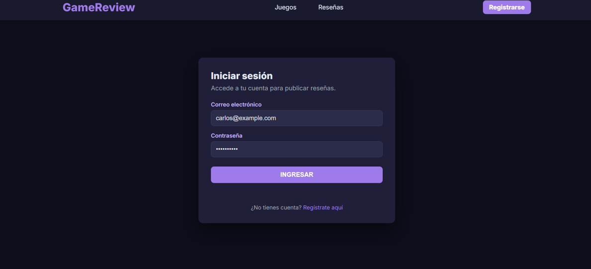
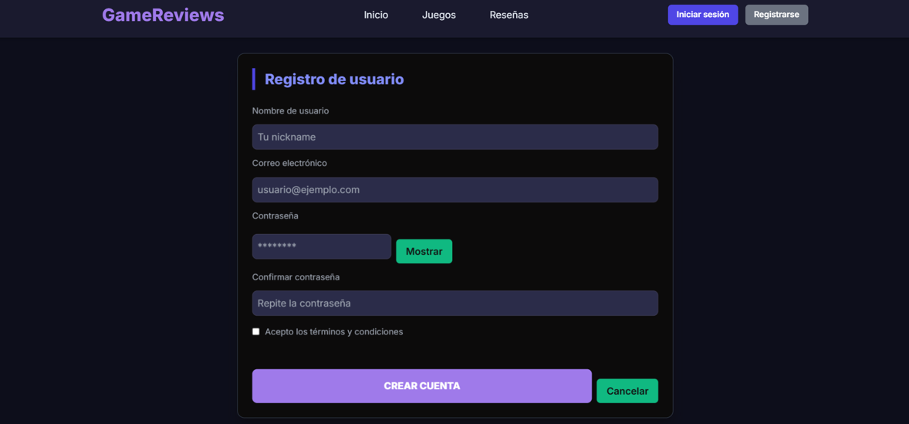
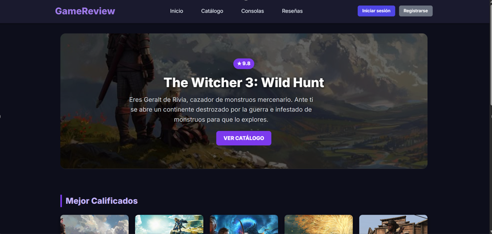
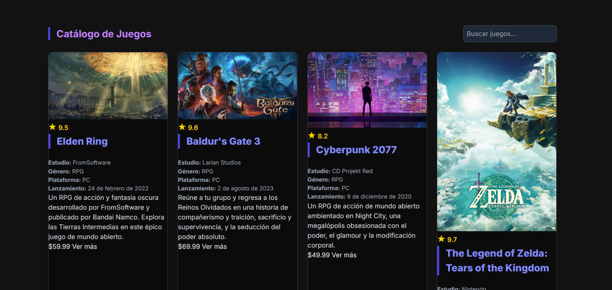
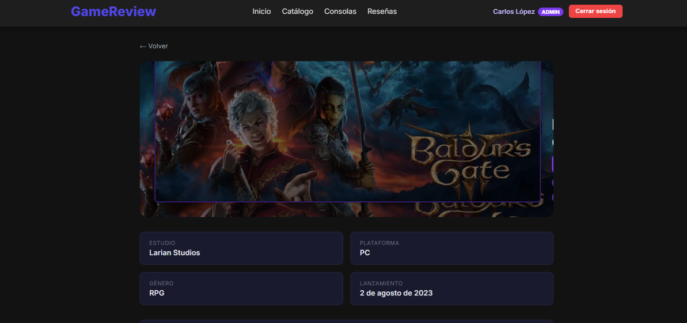
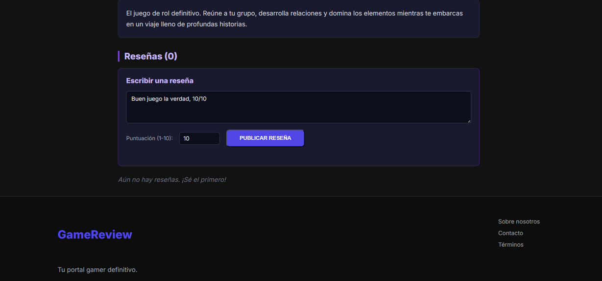

# 🎮 Game Reviews — Proyecto Nuevas Tecnologías

Aplicación web para registro de usuarios y publicación de reseñas de videojuegos.  
Integra **PostgreSQL (SQL)** y **MongoDB (NoSQL)** con un backend en **Python**.

---

## 🧩 Tecnologías usadas

- Python
- PostgreSQL
- MongoDB
- HTML, CSS, JavaScript
- PowerShell (configuración en Windows)

---

## 🚀 Instrucciones para ejecutar el proyecto

### 0️⃣ Clonar el repositorio

git clone https://github.com/XxsrdalxX/ProyectoNuevasTecnologias
cd game-reviews-backend-python

1️⃣ Configurar entorno virtual
cd game-reviews-backend-python
python -m venv .venv
Set-ExecutionPolicy -Scope Process -ExecutionPolicy Bypass
.\.venv\Scripts\Activate
pip install -r ./requirements.txt

2️⃣ Configurar Base de Datos PostgreSQL
Crear una base de datos llamada:
db_GameReviews
Ejecutar los archivos en este orden:
db_GR.sql o si no funciona el archivo crear_tablas.sql
datos_prueba.sql

3️⃣ Configurar MongoDB
Abrir PowerShell como administrador y ejecutar:
net start MongoDB
Respuesta esperada:
El servicio MongoDB se está iniciando
o
El servicio solicitado ya ha sido iniciado

Insertar datos de prueba en MongoDB
py seed_mongo.py
ModuleNotFoundError: No module named 'pymongo'
py -m pip install pymongo==4.7.3
py seed_mongo.py

4️⃣ Ejecutar el backend
python app.py
http://localhost:8080

GET  http://localhost:8080/api/juegos
GET  http://localhost:8080/api/juegos/1
GET  http://localhost:8080/api/resenas
POST http://localhost:8080/api/analytics/pageview
POST http://localhost:8080/api/analytics/interaction

GET http://localhost:8080/api/analytics/juego/1/stats
GET http://localhost:8080/api/analytics/usuario/1/perfil
GET http://localhost:8080/api/analytics/dashboard

LOGIN

  

Registro de usuario

  

Pantalla Principal

  

Catálogo de videojuegos

  

Vista de videojuego

  

Reseñas de usuarios

  

